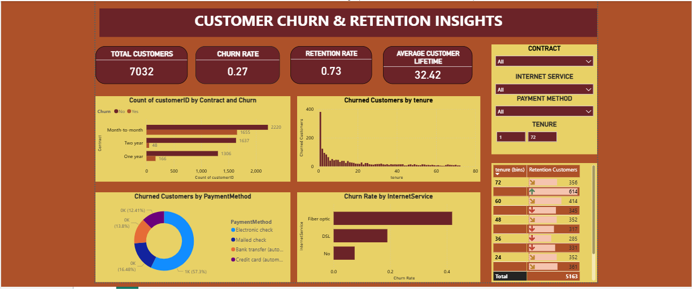

# customer-churn-dashboard

# 🚀 Project Overview

This project analyzes customer churn and retention patterns using Microsoft Power BI to help businesses understand customer behavior and improve retention strategies.

# 📌 Key Objectives

- Identify churn patterns.

- Analyze retention drivers.

- Study customer lifetime trends.

- Provide actionable business recommendations.

# 📊 Dashboard Preview

# 🔍 Key Insights

📉 Churn Patterns:

- Highest churn in month-to-month contracts.

- Most churn occurs in early tenure (0–6 months).

📈 Retention Drivers:

- Long-term contracts improve retention.

- Stable payment methods reduce churn.

⏳ Customer Lifetime Trends:

- Retention increases with tenure.

- Long-term users are more loyal.

# 💡 Recommendations

- Offer discounts for long-term plans.

- Improve onboarding experience.

- Focus on early-stage customer engagement.

- Optimize pricing strategies.

# 🛠 Tools Used

- Power BI

- Data Cleaning & Transformation

- Data Visualization
